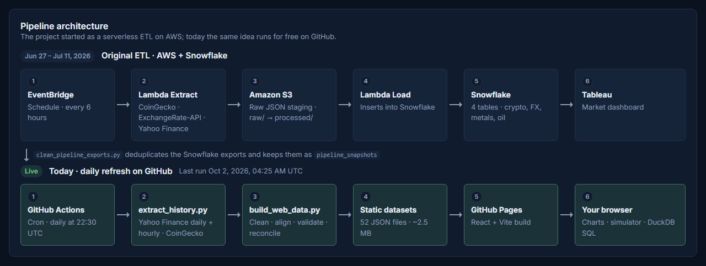
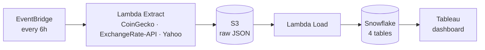
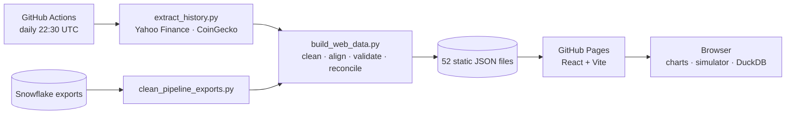

# Vectes — Market Data Pipeline & Interactive Dashboard

[](https://github.com/AristoclesofStgo/vectes/actions/workflows/deploy.yml)

**Live site → [aristoclesofstgo.github.io/vectes](https://aristoclesofstgo.github.io/vectes/)**

An end-to-end data engineering project. It started as **[Aurum](https://github.com/AristoclesofStgo/aurum-etl)**, a serverless ETL on AWS that captured crypto, currency, metal and oil prices every 6 hours into Snowflake. It grew into **Vectes**, an interactive market-data website that is rebuilt every day from one year of history for 24 assets, with charts, a portfolio backtester, cross-asset analytics and an in-browser SQL console.


## Highlights

- **TradingView-style charts** — daily and 4-hour candles, volume, SMA/EMA/Bollinger/RSI, asset comparison and a *market replay* that plays the past year back bar by bar.
- **Cross-currency pricing** — view any asset in USD, EUR, GBP, JPY, CHF, CAD, MXN, BRL, **gold ounces** or **bitcoin**, converted at each bar's exchange rate.
- **Portfolio simulator** — lump sum or DCA, four rebalancing rules, benchmarks, Sharpe ratio, drawdowns, P&L attribution and an efficient frontier. Every configuration is a shareable URL.
- **Cross-asset analysis** — correlation heatmap, risk vs. return, rolling correlation for any pair, and classic ratios (gold/silver, Brent–WTI, bitcoin in gold…).
- **Data Lab** — pipeline architecture, data quality report, reconciliation against a reference source, a data dictionary and a **DuckDB-WASM SQL playground** that runs entirely in the browser.
- **Self-refreshing at zero cost** — a scheduled GitHub Action extracts, validates and publishes new data every day; if a source fails, the deploy stops and the last good version stays online.

## Screenshots

| Portfolio simulator | Cross-asset analysis |
|---|---|
|  |  |

| Data Lab · SQL playground | Data Lab · pipeline & data quality |
|---|---|
|  |  |

<p align="center"></p>

## Architecture

The project has two stages that share the same idea: extract → stage → transform → serve.

**1 · Original ETL (June 27 – July 11, 2026)** · code in [aurum-etl](https://github.com/AristoclesofStgo/aurum-etl)



**2 · Today: daily refresh on GitHub**



The cleaned captures from the original pipeline are kept in `data/pipeline/` and shown on the site, reconciled against the reference history.

## Data

| Class | Assets | Source |
|---|---|---|
| Crypto | BTC, ETH, SOL, XRP, ADA | Yahoo Finance · CoinGecko (fundamentals) |
| Precious metals | Gold, silver, platinum, palladium (futures) | Yahoo Finance |
| Energy | WTI, Brent (futures) | Yahoo Finance |
| Currencies | EUR, GBP, JPY, CAD, CHF, MXN, BRL vs USD | Yahoo Finance |
| Indices & bonds | S&P 500, Nasdaq 100, US Aggregate Bond ETF | Yahoo Finance |
| Macro gauges | US 10Y yield, US Dollar Index, VIX | Yahoo Finance |

One year of daily bars plus hourly bars (aggregated to 4-hour candles) for every asset: about 2.5 MB of JSON, loaded per asset on demand.

## Data quality: what the data taught me

Cleaning and validating the data surfaced several real issues, each documented and fixed in code:

| Issue | Impact | Fix |
|---|---|---|
| Some S3 files were loaded into Snowflake more than once | **72%** of exported rows (2,891 of 4,007) were exact duplicates | Deduplicate, then snap each capture to its 6-hour schedule slot |
| Manual test runs on June 28 | 120 extra snapshots outside the schedule | Keep the latest capture per slot |
| `OPEN_PRICE` for metals and oil was the open from 7 days earlier | The "24h change" column was really a weekly change | Not used downstream; recomputed from prices |
| The free ExchangeRate-API publishes once a day | Most 6-hour FX captures repeat the previous value | Flagged as stale and excluded from statistics |
| Yahoo's daily FX bars close at London midnight, one session behind US markets | EUR/USD vs the Dollar Index showed −0.15 correlation instead of ≈ −0.9 | FX daily candles rebuilt from hourly bars with the 17:00 New York cutoff (now −0.92) |
| Crypto trades 24/7, other markets only on weekdays | Weekend zero-returns distort correlations and volatility | Analytics sample returns on US trading days |

Every price the original pipeline captured is reconciled against Yahoo Finance's hourly close at the same moment. The mean absolute difference was **≈9 bps for BTC and ETH** and 11–26 bps for metals.

## Tech stack

| Layer | Tools |
|---|---|
| Original pipeline | AWS Lambda, Amazon S3, Amazon EventBridge, Snowflake, Tableau |
| Data processing | Python, pandas, yfinance, GitHub Actions |
| Website | React 19, Vite, Zustand, React Router (hash routing) |
| Charts | lightweight-charts (TradingView), Apache ECharts |
| In-browser SQL | DuckDB-WASM |
| Hosting | GitHub Pages |

## Repository structure

```
├── data/pipeline/               # Cleaned captures from the AWS pipeline + reports
├── scripts/
│   ├── catalog.py               # Single source of truth for the 24 assets
│   ├── clean_pipeline_exports.py # aurum-etl Snowflake exports → data/pipeline/
│   ├── extract_history.py       # Yahoo Finance + CoinGecko → data/raw/
│   └── build_web_data.py        # data/ → web/public/data/ (validated JSON)
├── web/                         # Vectes website (React + Vite)
│   └── src/
│       ├── tabs/                # Market · Analysis · Portfolio · Data Lab
│       ├── components/
│       └── lib/                 # Backtesting, indicators, statistics, DuckDB
└── .github/workflows/deploy.yml # Daily refresh + deploy to GitHub Pages
```

## Running locally

```bash
pip install -r scripts/requirements.txt
python scripts/extract_history.py     # download one year of history
python scripts/build_web_data.py      # build the site's datasets
cd web && npm install && npm run dev
```

`data/pipeline/` is already committed. To rebuild it, clone [aurum-etl](https://github.com/AristoclesofStgo/aurum-etl) next to this repo (or set `AURUM_TABLEAU_DIR`) and run `python scripts/clean_pipeline_exports.py`. The setup of the original AWS pipeline is documented in that repo.

## Methodology notes

- Non-trading days carry the last close forward; the portfolio simulator measures returns per calendar day (365/yr) and the analytics per US trading day (252/yr).
- Sharpe ratios use the average US 10-year Treasury yield over the selected period as the risk-free rate.
- Index levels exclude dividends. The simulator ignores fees, spreads and taxes.

*For educational purposes only — not investment advice.*
