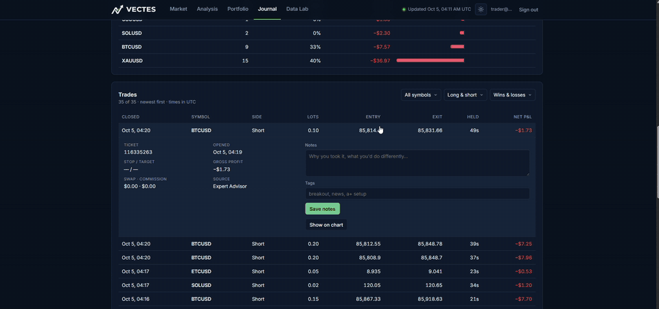

# Vectes — Market Data & MT4 Trading Journal

**Live site → [aristoclesofstgo.github.io/vectes](https://aristoclesofstgo.github.io/vectes/)**

A data project in three stages. It started as **Aurum**, a serverless pipeline on AWS that captured crypto, currency, metal and oil prices every 6 hours into Snowflake. It grew into **Vectes**, a market-data website rebuilt every day from one year of history for 24 assets. Today Vectes is also a **multi-user trading journal**: traders connect MetaTrader 4 through an Expert Advisor (or upload a statement) and see their own trades analysed and plotted on the same market data.

Try it without signing up: **Try demo** creates a 7-day account with sample trades built from the real candles.

## Trading journal

**Live trade:** a Bitcoin trade is closed in MT4, the Expert Advisor syncs it and one *Refresh* in Vectes updates the KPIs, the daily P&L calendar and the trade chart. Shown at 2.5× speed; [watch the full recording](docs/videos/live-trade.mp4).

- **MT4 Expert Advisor sync** — the EA sends every closed trade, deposit and withdrawal to Vectes, authenticated with a personal token the user can revoke. It back-fills the full history on first run and never asks for broker passwords (it cannot trade).
- **Statement import** — the MT4 *Detailed Statement* is read **in the browser**; only the trades are saved. Duplicates are skipped, so EA and statement data merge cleanly.
- **Any broker's naming** — broker symbols are recognised (`XAUUSD.m`, `US500.cash`, `usousd` → Vectes assets) and broker server time is converted to UTC.
- **Performance analytics** — net P&L, win rate, profit factor, expectancy, max drawdown, equity curve, a daily P&L calendar and breakdowns by symbol, session, weekday and side. Deposits and withdrawals never count as gains or drawdown. All 18 summary figures were verified against MT4's own report to the cent.
- **Trades on the chart** — entries and exits drawn at their exact prices on the Vectes candles, with notes and tags for every trade.
- **Privacy by design** — every user sees only their own data, EA tokens are stored hashed, statements are read locally, accounts and data can be deleted at any time, and demo accounts are purged automatically.

| Trades on the chart | Connect MetaTrader 4 |
|---|---|
|  |  |

## Market data

- **TradingView-style charts** — daily and 4-hour candles, volume, SMA/EMA/Bollinger/RSI, asset comparison and a *market replay* that plays the past year back bar by bar.
- **Cross-currency pricing** — view any asset in USD, EUR, GBP, JPY, CHF, CAD, MXN, BRL, **gold ounces** or **bitcoin**, converted at each bar's exchange rate.
- **Portfolio simulator** — lump sum or DCA, four rebalancing rules, benchmarks, Sharpe ratio, drawdowns, P&L attribution, an efficient frontier and a PDF report. Every configuration is a shareable URL.
- **Cross-asset analysis** — correlation heatmap, risk vs. return, rolling correlation for any pair, and classic ratios (gold/silver, Brent–WTI, bitcoin in gold…).
- **Data Lab** — a SQL playground that runs entirely in the browser, with a data dictionary.
- **Fresh every day** — new market data is extracted, validated and published daily; if a source fails, the last good version stays online.

## Screenshots

| Portfolio simulator | Cross-asset analysis |
|---|---|
|  |  |

| Data Lab · SQL playground | Journal · trades on the chart |
|---|---|
|  |  |

---

This repository hosts the published website: the `gh-pages` branch is rebuilt automatically every day with fresh market data. The source code is private. Questions, bugs or access requests: [open an issue](https://github.com/AristoclesofStgo/vectes/issues).

*For educational purposes only — not investment advice. See the [privacy notice and terms](https://aristoclesofstgo.github.io/vectes/#/privacy). Vectes is not affiliated with MetaQuotes or any broker.*

© 2026 Luis David Montes de Oca Hurtado. All rights reserved. See [LICENSE](LICENSE).
