# Vectes — Market Data & MT4 Trading Journal

[](https://github.com/AristoclesofStgo/vectes/actions/workflows/deploy.yml)

**Live site → [aristoclesofstgo.github.io/vectes](https://aristoclesofstgo.github.io/vectes/)**

An end-to-end data project in three stages. It started as **[Aurum](https://github.com/AristoclesofStgo/aurum-etl)**, a serverless ETL on AWS that captured crypto, currency, metal and oil prices every 6 hours into Snowflake. It grew into **Vectes**, a market-data website rebuilt every day from one year of history for 24 assets. Today Vectes is also a **multi-user trading journal**: traders connect MetaTrader 4 through an Expert Advisor (or upload a statement) and see their own trades analysed and plotted on the same market data.

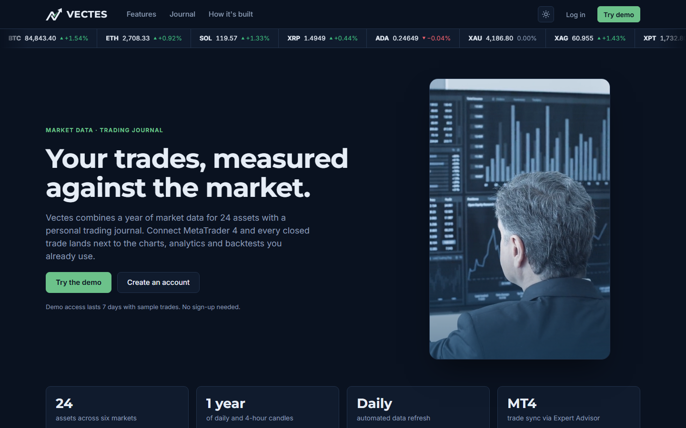

Try it without signing up: **Try demo** creates a 7-day account with sample trades built from the real candles.

**Data findings report → [docs/FINDINGS.md](docs/FINDINGS.md)**: requirements, architecture, the data-quality issues found in each pipeline, reconciliation against a reference source and the verification of the journal statistics.

## Trading journal

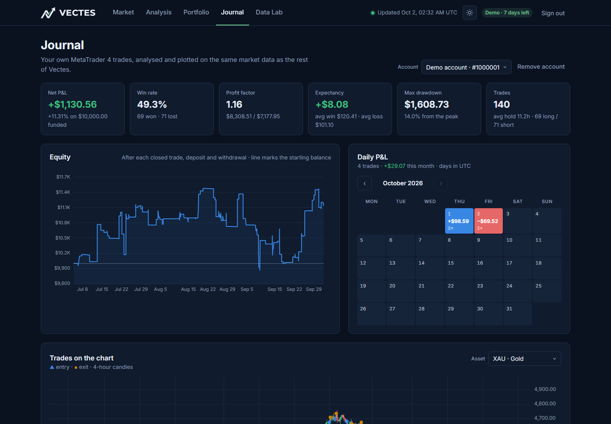

- **MT4 Expert Advisor sync** — an MQL4 EA sends every closed trade, deposit and withdrawal to a Supabase Edge Function, authenticated with a personal token the user can revoke. It back-fills the full history on first run, retries with back-off, and never asks for broker passwords (it cannot trade).
- **Statement import** — the MT4 *Detailed Statement* is parsed **in the browser**; only normalised trades are saved. Duplicates are skipped by ticket, so EA and statement data merge cleanly.
- **One canonical trades model** — broker symbols are normalised (`XAUUSD.m`, `US500.cash`, `usousd` → Vectes assets) and broker server time is converted to UTC with the New York close rule (UTC+2 in winter, UTC+3 in summer).
- **Performance analytics** — net P&L, win rate, profit factor, expectancy, max drawdown, equity curve, a daily P&L calendar and breakdowns by symbol, session, weekday and side. Deposits and withdrawals never count as gains or drawdown. All 18 summary figures were verified against MT4's own report to the cent.
- **Trades on the chart** — entries and exits drawn at their exact prices on the Vectes 4-hour candles, with notes and tags for every trade.
- **Privacy by design** — row-level security on every table, hashed EA tokens, statements parsed locally, self-service account and data deletion, and demo accounts purged automatically.

| Trades on the chart | Connect MetaTrader 4 |
|---|---|
| 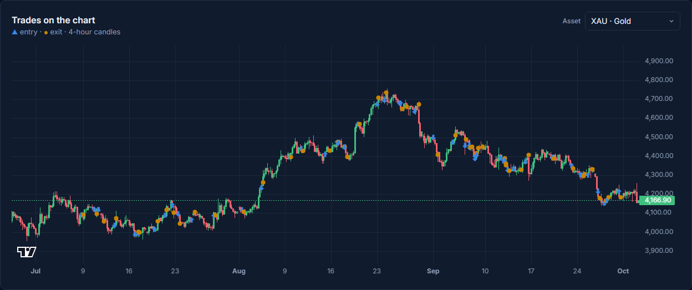 | 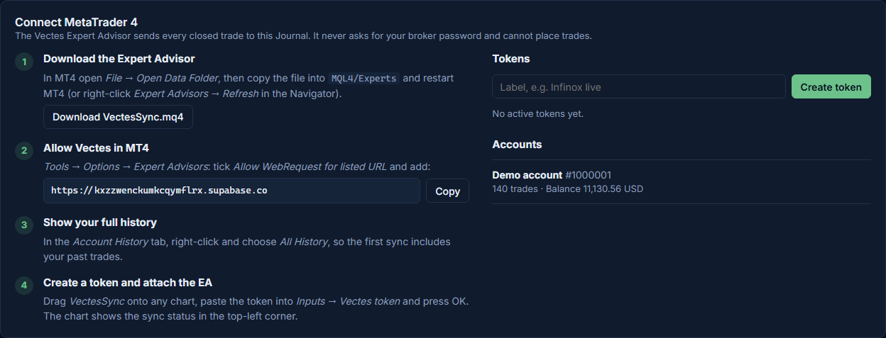 |

## Market data

- **TradingView-style charts** — daily and 4-hour candles, volume, SMA/EMA/Bollinger/RSI, asset comparison and a *market replay* that plays the past year back bar by bar.
- **Cross-currency pricing** — view any asset in USD, EUR, GBP, JPY, CHF, CAD, MXN, BRL, **gold ounces** or **bitcoin**, converted at each bar's exchange rate.
- **Portfolio simulator** — lump sum or DCA, four rebalancing rules, benchmarks, Sharpe ratio, drawdowns, P&L attribution and an efficient frontier. Every configuration is a shareable URL.
- **Cross-asset analysis** — correlation heatmap, risk vs. return, rolling correlation for any pair, and classic ratios (gold/silver, Brent–WTI, bitcoin in gold…).
- **Data Lab** — a **DuckDB-WASM SQL playground** that runs entirely in the browser, history coverage and a data dictionary. Pipeline architecture, data quality and reconciliation are documented in the [findings report](docs/FINDINGS.md).
- **Self-refreshing at zero cost** — a scheduled GitHub Action extracts, validates and publishes new data every day; if a source fails, the deploy stops and the last good version stays online.

## Screenshots

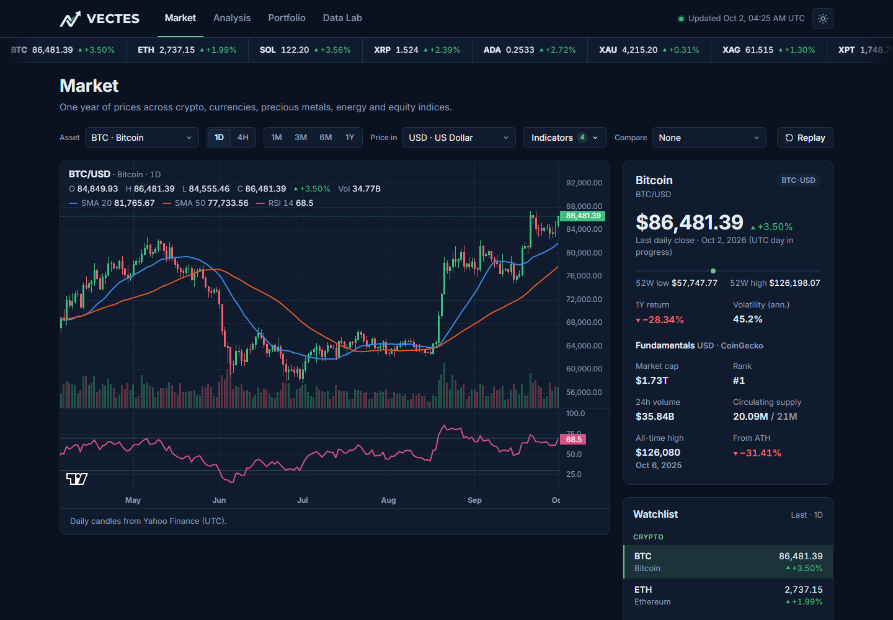

| Portfolio simulator | Cross-asset analysis |
|---|---|
| 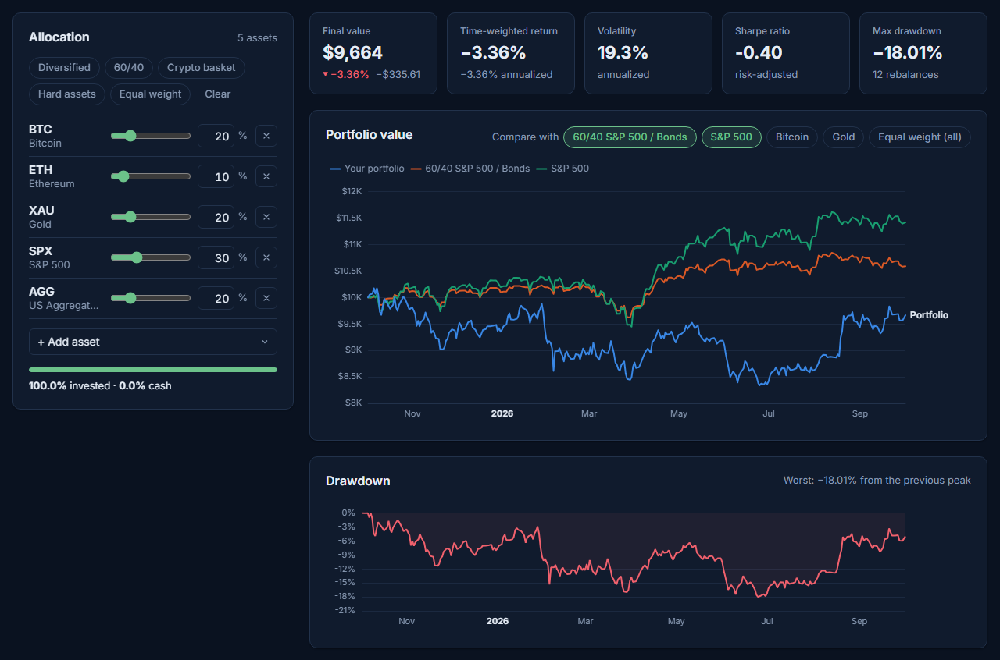 | 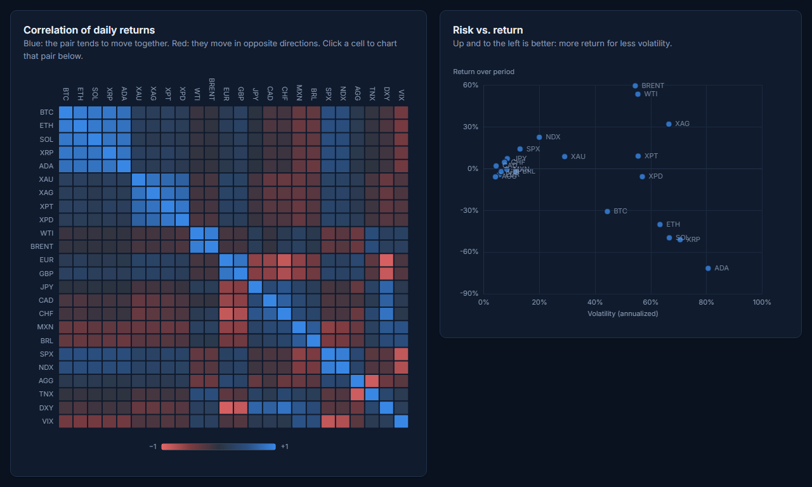 |

| Data Lab · SQL playground | Journal · trades on the chart |
|---|---|
| 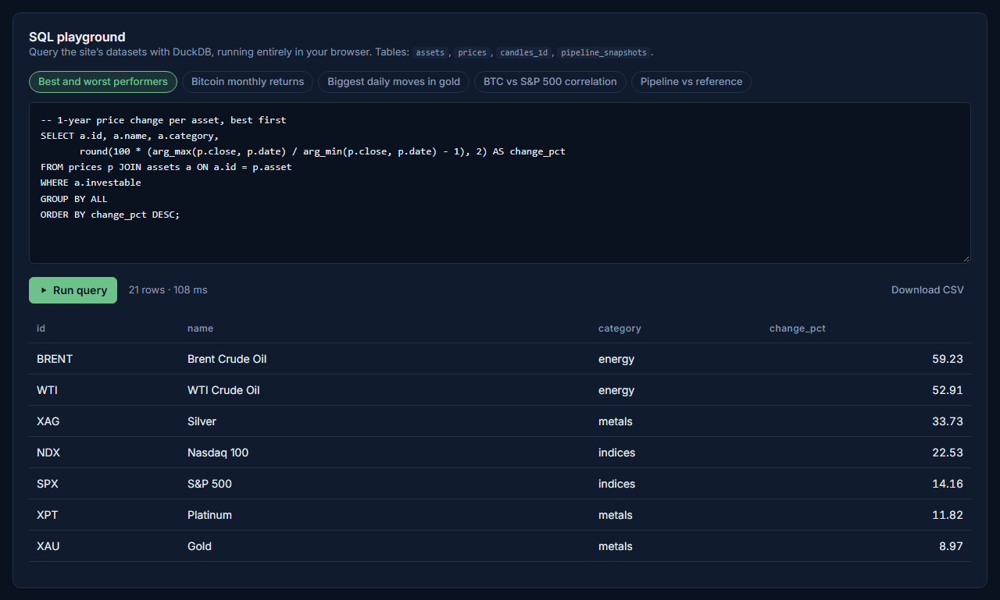 |  |

<p align="center">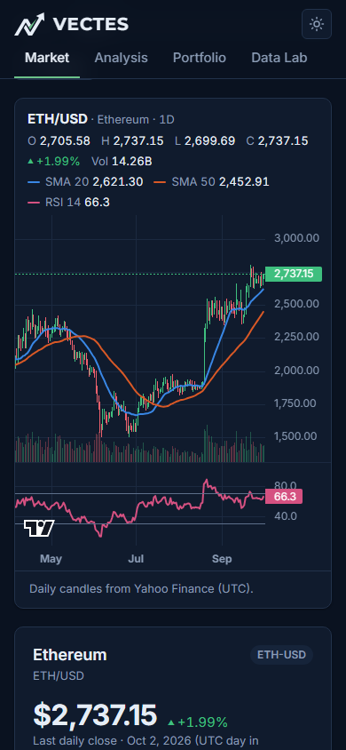</p>

## Architecture

The market data has two stages that share the same idea (extract → stage → transform → serve); the journal adds a third, user-owned data flow.

**1 · Original ETL (June 27 – July 11, 2026)** · code in [aurum-etl](https://github.com/AristoclesofStgo/aurum-etl)

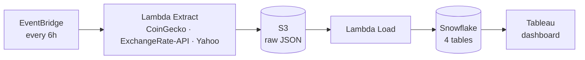

**2 · Today: daily refresh on GitHub**

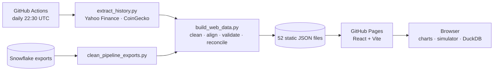

The cleaned captures from the original pipeline are kept in `data/pipeline/` and shown on the site, reconciled against the reference history.

**3 · Trading journal: Supabase + MetaTrader 4**

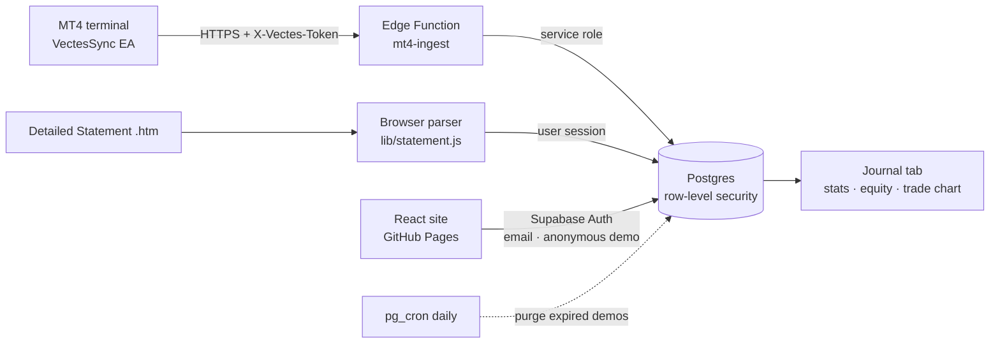

| Table | Holds | Protection |
|---|---|---|
| `profiles` | demo flag and access expiry | read-only to its owner, so a demo can't extend itself |
| `trading_accounts` | broker, account number, currency, balance, server offset | RLS: owner only, while access is valid |
| `trades` | one canonical row per closed position, unique per account + ticket | RLS + the account must belong to the caller |
| `cash_flows` | deposits, withdrawals and credit | RLS, same as trades |
| `ingest_tokens` | SHA-256 hash and prefix of each EA token | column grants: browsers can't write the hash or usage |

Security was tested with two real users against the live project: neither can read, insert, update or delete the other's rows, impersonate them, or extend a demo.

## Data

| Class | Assets | Source |
|---|---|---|
| Crypto | BTC, ETH, SOL, XRP, ADA | Yahoo Finance · CoinGecko (fundamentals) |
| Precious metals | Gold, silver, platinum, palladium (futures) | Yahoo Finance |
| Energy | WTI, Brent (futures) | Yahoo Finance |
| Currencies | EUR, GBP, JPY, CAD, CHF, MXN, BRL vs USD | Yahoo Finance |
| Indices & bonds | S&P 500, Nasdaq 100, US Aggregate Bond ETF | Yahoo Finance |
| Macro gauges | US 10Y yield, US Dollar Index, VIX | Yahoo Finance |

One year of daily bars plus hourly bars (aggregated to 4-hour candles) for every asset: about 2.5 MB of JSON, loaded per asset on demand.

## Data quality: what the data taught me

A summary; the full evidence, per-table counts and reconciliation results are in the [findings report](docs/FINDINGS.md).

Cleaning and validating the data surfaced several real issues, each documented and fixed in code:

| Issue | Impact | Fix |
|---|---|---|
| Some S3 files were loaded into Snowflake more than once | **72%** of exported rows (2,891 of 4,007) were exact duplicates | Deduplicate, then snap each capture to its 6-hour schedule slot |
| Manual test runs on June 28 | 120 extra snapshots outside the schedule | Keep the latest capture per slot |
| `OPEN_PRICE` for metals and oil was the open from 7 days earlier | The "24h change" column was really a weekly change | Not used downstream; recomputed from prices |
| The free ExchangeRate-API publishes once a day | Most 6-hour FX captures repeat the previous value | Flagged as stale and excluded from statistics |
| Yahoo's daily FX bars close at London midnight, one session behind US markets | EUR/USD vs the Dollar Index showed −0.15 correlation instead of ≈ −0.9 | FX daily candles rebuilt from hourly bars with the 17:00 New York cutoff (now −0.92) |
| Crypto trades 24/7, other markets only on weekdays | Weekend zero-returns distort correlations and volatility | Analytics sample returns on US trading days |

Every price the original pipeline captured is reconciled against Yahoo Finance's hourly close at the same moment. The mean absolute difference was **≈9 bps for BTC and ETH** and 11–26 bps for metals.

## Tech stack

| Layer | Tools |
|---|---|
| Original pipeline | AWS Lambda, Amazon S3, Amazon EventBridge, Snowflake, Tableau |
| Data processing | Python, pandas, yfinance, GitHub Actions |
| Website | React 19, Vite, Zustand, React Router (hash routing) |
| Charts | lightweight-charts (TradingView), Apache ECharts |
| In-browser SQL | DuckDB-WASM |
| Accounts & storage | Supabase Auth (email, anonymous demo), Postgres with row-level security, pg_cron |
| Server code | Supabase Edge Functions (Deno, TypeScript) |
| Trading platform | MetaTrader 4 Expert Advisor (MQL4) |
| Hosting | GitHub Pages |

## Repository structure

```
├── data/pipeline/               # Cleaned captures from the AWS pipeline + reports
├── scripts/
│   ├── catalog.py               # Single source of truth for the 24 assets
│   ├── clean_pipeline_exports.py # aurum-etl Snowflake exports → data/pipeline/
│   ├── extract_history.py       # Yahoo Finance + CoinGecko → data/raw/
│   └── build_web_data.py        # data/ → web/public/data/ (validated JSON)
├── supabase/
│   ├── migrations/              # Schema, row-level security, cash flows, demo purge
│   └── functions/
│       ├── mt4-ingest/          # Receives trades from the Expert Advisor
│       ├── delete-account/      # Self-service account deletion
│       └── _shared/             # Symbol map + broker server time (also used by the site)
├── web/                         # Vectes website (React + Vite)
│   ├── public/downloads/        # VectesSync.mq4 — the MT4 Expert Advisor
│   └── src/
│       ├── pages/               # Home · Login · Account · Privacy
│       ├── tabs/                # Market · Analysis · Portfolio · Journal · Data Lab
│       ├── components/
│       └── lib/                 # Backtesting, indicators, journal stats, statement parser, auth
└── .github/workflows/deploy.yml # Daily refresh + deploy to GitHub Pages
```

## Running locally

```bash
pip install -r scripts/requirements.txt
python scripts/extract_history.py     # download one year of history
python scripts/build_web_data.py      # build the site's datasets
cd web && npm install && npm run dev
```

The journal needs a Supabase project. The site ships with this project's URL and publishable key (public by design; RLS protects the data). To use your own, set `VITE_SUPABASE_URL` and `VITE_SUPABASE_ANON_KEY`, then:

```bash
# Apply the migrations in order (SQL editor, or the CLI)
supabase db query --linked -f supabase/migrations/20261002_0001_journal_schema.sql
supabase db query --linked -f supabase/migrations/20261002_0002_mt4_ingest.sql
supabase db query --linked -f supabase/migrations/20261002_0003_cash_flows.sql
# The EA has no Supabase session: its token is the auth, so JWT checks are off for mt4-ingest only
supabase functions deploy mt4-ingest --no-verify-jwt
supabase functions deploy delete-account
```

In the dashboard enable **anonymous sign-ins** (for the demo) and add the site URL to the auth redirect URLs. Point the EA's `ENDPOINT` at your project.

`data/pipeline/` is already committed. To rebuild it, clone [aurum-etl](https://github.com/AristoclesofStgo/aurum-etl) next to this repo (or set `AURUM_TABLEAU_DIR`) and run `python scripts/clean_pipeline_exports.py`. The setup of the original AWS pipeline is documented in that repo.

## Methodology notes

- Non-trading days carry the last close forward; the portfolio simulator measures returns per calendar day (365/yr) and the analytics per US trading day (252/yr).
- Sharpe ratios use the average US 10-year Treasury yield over the selected period as the risk-free rate.
- Index levels exclude dividends. The simulator ignores fees, spreads and taxes.
- Journal statistics use net P&L (profit + swap + commission + taxes). Return is measured on the capital funded; deposits and withdrawals move the drawdown peak with them. Sessions and weekdays use the trade's opening time in UTC.

*For educational purposes only — not investment advice. See the [privacy notice and terms](https://aristoclesofstgo.github.io/vectes/#/privacy). Vectes is not affiliated with MetaQuotes or any broker.*
