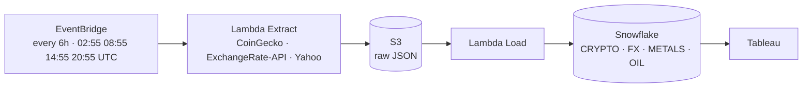
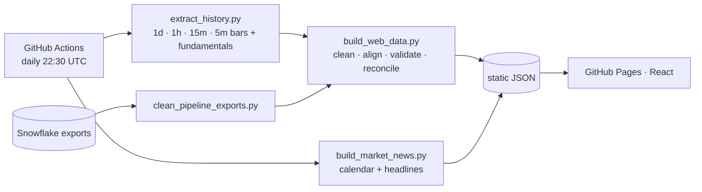
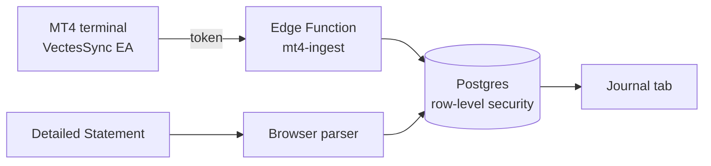
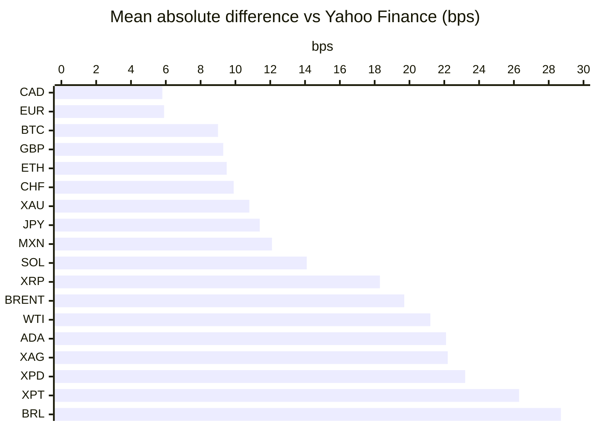

# Vectes · Data findings report

How the data behind Vectes is produced, what went wrong along the way and how each issue was resolved. This report complements the [README](../README.md): the README describes the product, this document records the process and its evidence.

| | |
|---|---|
| **Scope** | Original AWS pipeline (Jun 27 – Jul 11, 2026), the daily GitHub Actions pipeline that replaced it, and the trading-journal ingestion (MT4 Expert Advisor and statement import) |
| **Data** | 24 assets: crypto, precious metals, energy, currencies, equity indices and macro gauges |
| **Sources** | CoinGecko, ExchangeRate-API, Yahoo Finance, Forex Factory calendar, MetaTrader 4 |
| **Headline numbers** | 72% of the original Snowflake rows were exact duplicates · captured prices within ≈9 bps of the reference for BTC/ETH · journal statistics match MT4's own report to the cent |

---

## 1. Objectives and requirements

| # | Requirement | How it is met | Status |
|---|---|---|---|
| R1 | Capture prices for crypto, FX, metals and oil on a schedule | EventBridge every 6 hours → Lambda → S3 → Snowflake (original); GitHub Actions daily (current) | Met |
| R2 | Keep a clean, deduplicated history | Deduplication and schedule-slot snapping of the Snowflake exports; validated daily rebuild | Met |
| R3 | Prove the captured prices are right | Every capture reconciled against Yahoo Finance's hourly close at the same moment | Met |
| R4 | Serve the data at no running cost | Static JSON on GitHub Pages, rebuilt daily; the deploy aborts and keeps the last good version if a source fails | Met |
| R5 | Let users bring their own trades without sharing broker credentials | MQL4 Expert Advisor with a revocable, hashed token; MT4 statements parsed in the browser | Met |
| R6 | Keep each user's data private | Row-level security on every table, verified with two users against the live project | Met |

---

## 2. Architecture

### 2.1 Original ETL on AWS (Jun 27 – Jul 11, 2026)

### 2.2 Current pipeline on GitHub

### 2.3 Trading journal

---

## 3. Data quality of the original pipeline

The four Snowflake tables were exported on Jul 11, 2026 and cleaned by `scripts/clean_pipeline_exports.py`.

| Table | Source | Raw rows | Exact duplicates | Test-run rows | Clean snapshots | Stale points |
|---|---|---:|---:|---:|---:|---:|
| CRYPTO_PRICES | CoinGecko | 1,120 | 800 | 40 | 280 | 0 |
| FX_PRICES | ExchangeRate-API | 1,603 | 1,155 | 56 | 392 | 287 |
| METALS_PRICES | Yahoo Finance | 860 | 628 | 16 | 216 | 58 |
| OIL_PRICES | Yahoo Finance | 424 | 308 | 8 | 108 | 29 |
| **Total** | | **4,007** | **2,891 (72%)** | **120** | **996** | **374** |

### Issues found

| # | Finding | Evidence | Impact | Resolution |
|---|---|---|---|---|
| Q1 | Some S3 files were loaded into Snowflake more than once | 2,891 of 4,007 rows were exact duplicates | Every aggregate over-counted | Drop exact duplicates, then keep one capture per 6-hour slot |
| Q2 | Manual test runs on Jun 28 | 120 snapshots outside the schedule | Uneven sampling | Snap captures to their schedule slot and keep the latest |
| Q3 | `OPEN_PRICE` for metals and oil was the open from 7 days earlier | `PRICE_CHANGE_PCT_24H` tracked weekly moves | The "24h change" column was mislabelled | Not used downstream; changes recomputed from prices |
| Q4 | ExchangeRate-API's free tier publishes once a day | Most 6-hour FX captures repeat the previous value (287 stale points) | Fake zero returns | Flagged as stale and excluded from statistics |
| Q5 | Range columns were never populated | `HIGH/LOW_30D` and `HIGH/LOW_52W` always null; 11 empty columns in FX | Dead schema | Documented; not exported |

---

## 4. Reconciliation against a reference source

**Method.** Each clean, non-stale capture is compared with Yahoo Finance's hourly close at the same moment (56 six-hour slots over the two weeks). The difference is expressed in basis points (1 bp = 0.01%).

| Group | Assets | Mean abs. difference | Largest single difference | Compared captures |
|---|---|---|---|---|
| Major FX | CAD, EUR, GBP, CHF, JPY | 5.8 – 11.4 bps | 57.7 bps (JPY) | 15 each (stale captures excluded) |
| Large-cap crypto | BTC, ETH | 9.0 – 9.5 bps | 42.3 bps (ETH) | 56 each |
| Gold | XAU | 10.8 bps | 29.4 bps | 40 |
| Other crypto | SOL, XRP, ADA | 14.1 – 22.1 bps | 136.1 bps (ADA) | 56 each |
| Oil | BRENT, WTI | 19.7 – 21.2 bps | 82.6 bps (WTI) | 39 – 40 |
| Other metals | XAG, XPD, XPT | 22.2 – 26.3 bps | 93.4 bps (XPD) | 38 – 40 |
| Emerging FX | MXN, BRL | 12.1 – 28.7 bps | 65.8 bps (BRL) | 15 each |

**Reading.** The pipeline captured the right prices: liquid markets sit within about 10 bps of the reference. Larger gaps follow liquidity and timing. Thin crypto and platinum-group metals move more between the capture second and the reference hour close, and BRL's daily FX source lags intraday moves.

---

## 5. Findings from the current pipeline and the journal

| # | Finding | Impact | Resolution |
|---|---|---|---|
| P1 | Yahoo's daily FX bars close at London midnight, one session behind US markets | EUR/USD vs the Dollar Index showed −0.15 correlation instead of about −0.9 | FX daily candles rebuilt from hourly bars with the 17:00 New York cutoff (now −0.92) |
| P2 | Some Yahoo bars report a high or low inside the open/close range | Malformed candles | Wicks widened to contain the body; repairs counted per asset |
| P3 | Crypto trades 24/7, other markets on weekdays | Weekend zero returns distort correlation and volatility | Analytics sample returns on US trading days |
| P4 | Yahoo serves sub-hourly bars for the last 60 days only | 5m and 15m history is limited | 15m kept for 60 days, 5m for 30 days; the chart says when a trade falls outside |
| P5 | Vectes metals, oil and indices are futures; MT4 brokers quote spot or CFDs | Real XAUUSD trades plotted about $29 below the candles | The Journal chart shifts candles by the median broker gap (e.g. −29.26 on gold, +2.26 on WTI), with a visible switch |
| P6 | MT4 reports times in the broker's server clock, which follows New York close (UTC+2 in winter, UTC+3 in summer) | A fixed offset put half of any long history one hour off | Per-timestamp conversion using US daylight-saving rules for brokers on +2h/+3h |
| P7 | MT4 statements write thousands with a space (`1 000.00`) and include cancelled pending orders | Naive parsing misreads balances and adds non-trades | Locale-aware number parsing; only executed buy/sell rows become trades |
| P8 | The economic-calendar feed allows only a few requests per 5 minutes | HTTP 429 during repeated runs | Honours `Retry-After`; falls back to the last published copy so the price deploy is never blocked |
| P9 | Synthetic demo trades depended on the day's candles | One build produced a demo with a −$4,863 loss | Every demo trade has a stop and a target, and the generator picks a believable history (positive net, 45–62% win rate, drawdown under 15%) |

### Verification of the journal statistics

The 18 trades of a real MT4 Detailed Statement were sent through the Expert Advisor path and imported as a statement. Every figure of MT4's own summary was reproduced exactly:

| Metric | MT4 report | Vectes |
|---|---:|---:|
| Net profit | −61.35 | −61.35 |
| Gross profit / gross loss | 28.69 / 90.04 | 28.69 / 90.04 |
| Profit factor | 0.32 | 0.32 |
| Expected payoff | −3.41 | −3.41 |
| Maximal drawdown | 64.44 (6.42%) | 64.44 (6.42%) |
| Short / long trades won | 12 (25%) / 6 (50%) | 12 (25%) / 6 (50%) |
| Largest profit / loss trade | 10.60 / −28.35 | 10.60 / −28.35 |
| Max consecutive wins / losses | 2 / 4 | 2 / 4 |

---

## 6. Limitations

- Market data refreshes once a day after the US close, so trades from the current day appear on the Journal chart the next day.
- Futures-to-spot alignment uses one offset per asset and chart; the futures basis drifts over months, so very old trades can sit slightly off their candles.
- The economic calendar covers the current week only, which is what the free feed publishes.
- Market data is provided for education and may be delayed or incomplete; it is not investment advice.
